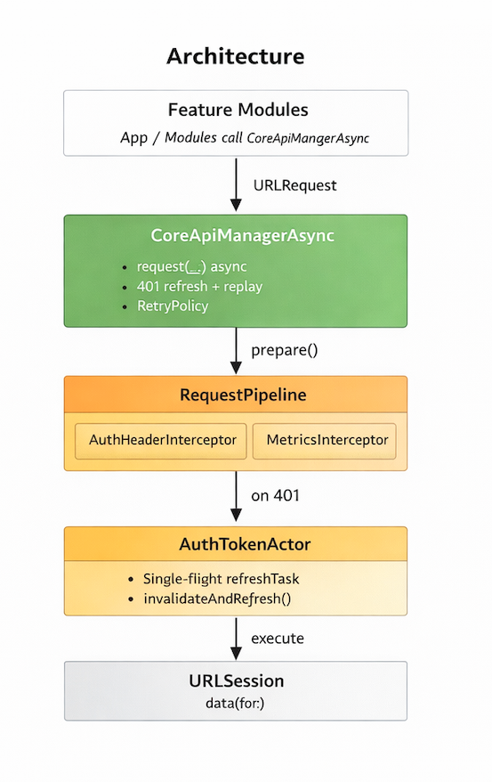
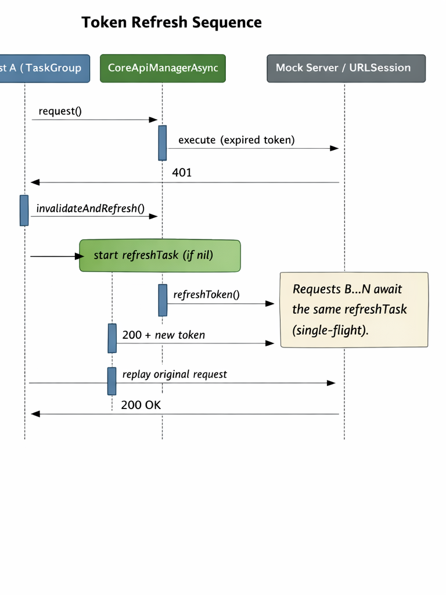

# CoreApiManagerAsync
Production-grade Swift Concurrency networking framework with actor-based token refresh, retry orchestration, and enterprise-scale observability.

## Architecture

## Token refresh sequence

## Design Decisions

### 1. Actor-Based Token State Management
`AuthTokenActor` isolates mutable authentication state using Swift concurrency.
This guarantees single-flight refresh behavior under high concurrency and prevents token refresh storms when multiple requests receive 401 simultaneously.

### 2. Single-Flight Refresh Pattern
When a 401 occurs, only the first request triggers a refresh.
All concurrent requests await the same `refreshTask`.
Additionally, stale in-flight 401 responses do not trigger new refresh cycles if a newer token already exists.
This prevents refresh amplification under load.

### 3. Interceptor-Based Request Pipeline
Networking logic is separated using a `RequestPipeline` abstraction.
Interceptors (e.g., `AuthHeaderInterceptor`) allow composable behaviors such as:
- Authentication
- Metrics instrumentation
- Logging
- Request mutation
This keeps `CoreApiManagerAsync` focused on orchestration, not cross-cutting concerns.

### 4. Deterministic Retry Policy
`RetryPolicy` encapsulates exponential backoff and retry rules.
This avoids retry storms during transient failures (e.g., 429, 5xx).
Retry behavior is explicit and testable.

### 5. Concurrency Stress Validation
The framework includes a 500-parallel-request stress test using `URLProtocol`.
The test validates:
- Single token refresh under concurrency
- Successful replay after refresh
- Deterministic 401 handling
CI ensures this behavior remains stable across changes.

### 6. Explicit Error Taxonomy
Transport, HTTP, cancellation, and decoding errors are modeled explicitly via `NetworkError`.
This avoids ambiguous error propagation and improves observability.
